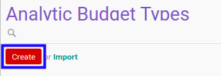

# Membuat Budget Type

## A. INPUT

*(Tidak ada instruksi khusus)*

## B. LANGKAH KERJA

1. Buka menu **Accounting -> Configuration -> Analytic Budget -> Types**. Abaikan jika sudah berada pada menu yang dimaksud.
2. Klik tombol **Create** pada bagian atas-kiri form.

3. Isi **[Analytic Budget Type](./penjelasan.md#field-header-analytic-budget-type)**. Wajib diisi.
4. Isi **[Code](./penjelasan.md#field-header-code)**. Wajib diisi.
5. Beralih ke tab **[General Settings](./penjelasan.md#tab-general-setting)**.
6. Pilih **[Sequence](./penjelasan.md#field-general-setting-sequence)**. Tidak wajib diisi.
7. Beralih ke tab **[Allowed Accounts](./penjelasan.md#tab-allowed-account)**.
8. Pilih **[Revenue](./penjelasan.md#field-allowed-account-revenue)**. Tidak wajib diisi.
9. Pilih **[Cost](./penjelasan.md#field-allowed-account-cost)**. Tidak wajib diisi.
10. <a name="l10">[Tambah](./menambahkan-akun-revenue.md)/[Modifikasi](./memodifikasi-akun-revenue.md)/[Hapus](./menghapus-akun-revenue.md) **Revenue Accounts**</a>. Ulangi langkah ini sampai **Revenue Accounts** sesuai dengan keinginan.
11. <a name="l11">[Tambah](./menambahkan-akun-cost.md)/[Modifikasi](./memodifikasi-akun-cost.md)/[Hapus](./menghapus-akun-cost.md) **Cost Accounts**</a>. Ulangi langkah ini sampai **Cost Accounts** sesuai dengan keinginan.
12. Beralih ke tab **[Workflow Policy](./penjelasan.md#tab-workflow-policy)**.
13. Pilih **[Allowed To Confirm Analytic Budget](./penjelasan.md#field-allow-to-confirm)**. Tidak wajib diisi.
14. Pilih **[Allowed To Restart Analytic Budget Approval](./penjelasan.md#field-allow-to-restart-approval)**. Tidak wajib diisi.
15. Pilih **[Allowed To Cancel Analytic Budget](./penjelasan.md#field-allow-to-cancel)**. Tidak wajib diisi.
16. Pilih **[Allowed To Restart Analytic Budget](./penjelasan.md#field-allow-to-restart)**. Tidak wajib diisi.
17. Beralih ke tab **[Note](./penjelasan.md#tab-note)**.
18. Isi **[Note](./penjelasan.md#field-note)**. Tidak wajib diisi.
19. Klik tombol **Save** pada bagian atas-kiri form.

## C. OUTPUT

* Data *analytic budget type* akan terbuat
