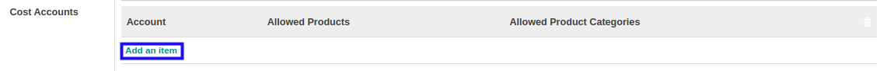

# Menambahkan Akun Cost

*(Instruksi kerja ini merupakan sub instruksi dari (1) [Membuat Budget Type](./membuat.md), atau (2) [Memodifikasi Budget Type](./memodifikasi.md). Instruksi kerja ini tidak bisa berdiri sendiri)*

## A. INPUT

*(Tidak ada instruksi khusus)*

## B. LANGKAH KERJA

1. Klik label **Add an Item** pada bagian atas-kiri tabel ***Cost Accounts***

2. Pilih **[Account](./penjelasan.md#field-allowed-account-cost-account)**. Wajib diisi.
3. Pilih **[Allowed Products](./penjelasan.md#field-allowed-account-cost-product)**. Tidak wajib diisi.
4. Pilih **[Allowed Product Categories](./penjelasan.md#field-allowed-account-cost-product-categories)**. Tidak wajib diisi.
5. Lanjutkan [langkah ke-11 instruksi kerja Membuat Budget Type](./membuat.md#l11) atau [langkah ke-12 instruksi kerja Memodifikasi Budget Type](./memodifikasi.md#l12).

## C. OUTPUT

*(Tidak ada instruksi khusus)*
