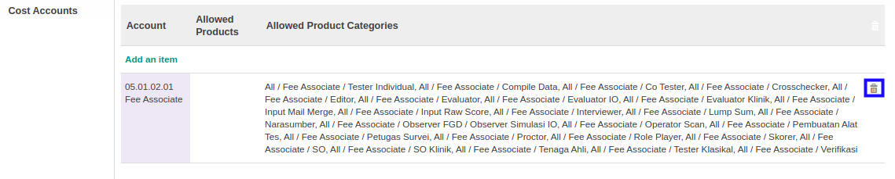

# Menghapus Akun Cost

*(Instruksi kerja ini merupakan sub instruksi dari (1) [Membuat Budget Type](./membuat.md), atau (2) [Memodifikasi Budget Type](./memodifikasi.md). Instruksi kerja ini tidak bisa berdiri sendiri)*

## A. INPUT

*(Tidak ada instruksi khusus)*

## B. LANGKAH KERJA

1. Klik icon tempat sampah pada bagian kanan data **Cost Account** yang akan dihapus.

2. Lanjutkan [langkah ke-11 instruksi kerja Membuat Budget Type](./membuat.md#l11) atau [langkah ke-12 instruksi kerja Memodifikasi Budget Type](./memodifikasi.md#l12).

## C. OUTPUT

*(Tidak ada instruksi khusus)*
