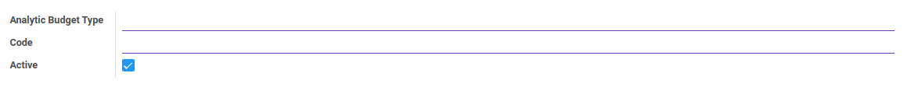
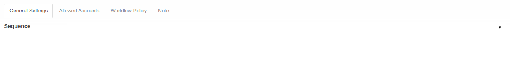
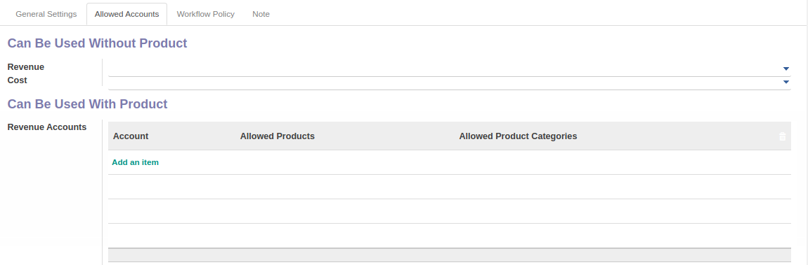
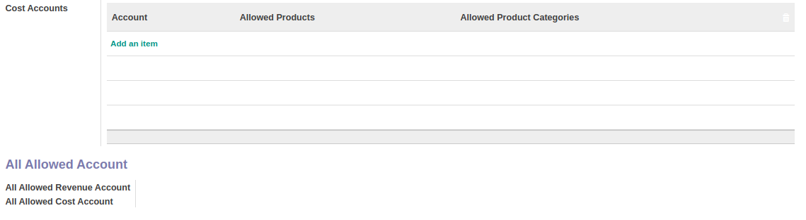
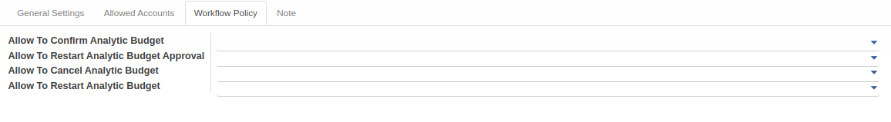
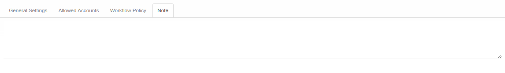

# Penjelasan Budget Type

Informasi pada *Budget Type* dibagi menjadi beberapa bagian, yaitu:

* [Header](#bagian-header)
* [Tab General Settings](#tab-general-setting)
* [Tab Allowed Accounts](#tab-allowed-account)
* [Tab Workflow Policy](#tab-workflow-policy)
* [Tab Note](#tab-note)

### <a name="bagian-header">HEADER</a>

#### <a name="field-header-analytic-budget-type">Analytic Budget Type</a>

Tipe analitik budget.

#### <a name="field-header-code">Code</a>

Kode analitik budget.

#### <a name="field-header-active">Active</a>

Sebagai penanda apakah data adalah aktif/non-aktif.

#### <a name="tab-general-setting">TAB GENERAL SETTINGS</a>

#### <a name="field-general-setting-sequence">Sequence</a>

Sequence yang digunakan.

#### <a name="tab-allowed-account">TAB ALLOWED ACCOUNTS</a>

#### <a name="field-allowed-account-without-product">*Can Be Used Without Product*</a>

#### <a name="field-allowed-account-revenue">Revenue</a>

To do.

#### <a name="field-allowed-account-cost">Cost</a>

To do.

#### <a name="field-allowed-account-with-product">*Can Be Used With Product*</a>

#### <a name="field-allowed-account-with-product-revenue-table">TABEL Revenue Accounts</a>

#### <a name="field-allowed-account-revenue-account">Account</a>

Akun revenue yang diperbolehkan.

#### <a name="field-allowed-account-revenue-product">Allowed Products</a>

Produk yang diperbolehkan.

#### <a name="field-allowed-account-revenue-product-categories">Allowed Product Categories</a>

Kategori Produk yang diperbolehkan.

#### <a name="field-allowed-account-with-product-cost-table">TABEL Cost Accounts</a>

#### <a name="field-allowed-account-cost-account">Account</a>

Akun biaya yang diperbolehkan.

#### <a name="field-allowed-account-cost-product">Allowed Products</a>

Produk yang diperbolehkan.

#### <a name="field-allowed-account-cost-product-categories">Allowed Product Categories</a>

Kategori Produk yang diperbolehkan.

#### <a name="field-allowed-account-all">*All Allowed Accounts*</a>

#### <a name="field-allowed-account-all-revenue">All Allowed Revenue Account</a>

Seluruh akun revenue yang diperbolehkan.

#### <a name="field-allowed-account-all-cost">All Allowed Cost Account</a>

Seluruh akun biaya yang diperbolehkan.

#### <a name="tab-workflow-policy">TAB WORKFLOW POLICY</a>

#### <a name="field-allow-to-confirm">Allow To Confirm Analytic Budget</a>

Berhak/tidaknya user aktif untuk dapat mengkonfirmasi analitik budget.

#### <a name="field-allow-to-restart-approval">Allow To Restart Analytic Budget Approval</a>

Berhak/tidaknya user aktif untuk dapat merestart persetujuan analitik budget.

#### <a name="field-allow-to-cancel">Allow To Cancel Analytic Budget</a>

Berhak/tidaknya user aktif untuk dapat membatalkan analitik budget.

#### <a name="field-allow-to-restart">Allow To Restart Analytic Budget</a>

Berhak/tidaknya user aktif untuk dapat merestart analitik budget.

#### <a name="tab-note">TAB NOTE</a>

#### <a name="field-note">Note</a>

Catatan.
