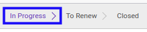

# Membuat Analytic Account

## A. INPUT

*(Tidak ada instruksi khusus)*

## B. LANGKAH KERJA

1. Buka menu **Accounting -> Configuration -> Analytic Accounting -> Analytic Account**. Abaikan jika sudah berada pada menu yang dimaksud.
2. Klik tombol **Create** pada bagian atas-kiri form.

3. Isi **[Account/Contract Name](./penjelasan.md#field-header-account-name)**. Wajib diisi.
4. Aktifkan/ Deaktifkan **[Timesheets](./penjelasan.md#field-header-timesheet)**. Tidak wajib diisi.
5. Aktifkan/ Deaktifkan **[Tasks](./penjelasan.md#field-header-tasks)**. Tidak wajib diisi.
6. Aktifkan/ Deaktifkan **[Issues](./penjelasan.md#field-header-issues)**. Tidak wajib diisi.
7. Pilih **[Customer](./penjelasan.md#field-header-customer)**. Tidak wajib diisi.
8. Pilih **[Account Manager](./penjelasan.md#field-header-account-mgr)**. Tidak wajib diisi.
9. Pilih **[Type of Account](./penjelasan.md#field-header-type-account)**. Wajib diisi.
10. Isi **[Reference](./penjelasan.md#field-header-reference)**. Tidak wajib diisi.
11. Pilih **[Parent Analytic Account](./penjelasan.md#field-header-parent-account)**. Tidak wajib diisi.
12. Pilih **[Company](./penjelasan.md#field-header-company)**. Wajib diisi.
13. Beralih ke tab **[General Account Substitution](./penjelasan.md#tab-general-account)**.
14. <a name="l14">[Tambah](./menambahkan-akun.md)/[Modifikasi](./memodifikasi-akun.md)/[Hapus](./menghapus-akun.md) **General Account Substitution**</a>. Ulangi langkah ini sampai **General Account Substitution** sesuai dengan keinginan.
15. Beralih ke tab **[Accrue Expense](./penjelasan.md#tab-accrue-expense)**.
16. Pilih **[Accrue Expense Journal](./penjelasan.md#field-accrue-expense-journal)**. Tidak wajib diisi.
17. Pilih **[Accrue Expense Account](./penjelasan.md#field-accrue-expense-account)**. Tidak wajib diisi.
18. Aktifkan/ Deaktifkan **[Can Create Accrue Expense](./penjelasan.md#field-accrue-expense-create)**. Tidak wajib diisi.
19. Beralih ke tab **[Timesheet Product Policy](./penjelasan.md#tab-timesheet-product)**.
20. <a name="l20">[Tambah](./menambahkan-kategori-produk.md)/[Hapus](./menghapus-kategori-produk.md) **Allowed Product Categories**</a>. Ulangi langkah ini sampai **Allowed Product Categories** sesuai dengan keinginan.
21. <a name="l21">[Tambah](./menambahkan-produk.md)/[Hapus](./menghapus-produk.md) **Allowed Products**</a>. Ulangi langkah ini sampai **Allowed Products** sesuai dengan keinginan.
22. Beralih ke tab **[Timesheet Pricelist](./penjelasan.md#tab-timesheet-pricelist)**.
23. <a name="l23">[Tambah](./menambahkan-timesheet-pricelist.md)/[Modifikasi](./memodifikasi-timesheet-pricelist.md)/[Hapus](./menghapus-timesheet-pricelist.md) **Timesheet Pricelist**</a>. Ulangi langkah ini sampai **Timesheet Pricelist** sesuai dengan keinginan.
24. Beralih ke tab **[Accrue Income](./penjelasan.md#tab-accrue-income)**.
25. Pilih **[Accrue Income Journal](./penjelasan.md#field-accrue-income-journal)**. Tidak wajib diisi.
26. Pilih **[Accrue Income Account](./penjelasan.md#field-accrue-income-account)**. Tidak wajib diisi.
27. Aktifkan/ Deaktifkan **[Can Create Accrue Income](./penjelasan.md#field-accrue-income-create)**. Tidak wajib diisi.
28. Klik tombol **Save** pada bagian atas-kiri form.

## C. OUTPUT

* Data *analytic account* akan terbuat dengan status **In Progress**

