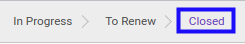

# Membuka Kembali Analytic Account

## A. INPUT

* Data *Analytic Account* yang dapat dibatalkan harus memiliki status **Cancelled** atau **Closed**

* User yang akan membuka kembali harus memiliki akses untuk membuka kembali *Analytic Account*.

## B. LANGKAH KERJA

1. Buka menu **Accounting -> Configuration -> Analytic Accounting -> Analytic Account**. Abaikan jika sudah berada pada menu yang dimaksud.
2. Buka data *Analytic Account* yang akan dibuka kembali. Abaikan jika data sudah dibuka.
3. Klik tombol **Set In Progress** pada bagian atas-kiri form.

## C. OUTPUT

* Status dari *Analytic Account* akan berubah menjadi **In Progress**.

