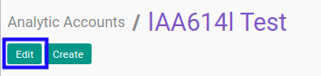

# Memodifikasi Analytic Account

## A. INPUT

* Data *Analytic Account* yang dapat dimodifikasi harus memiliki status **In Progress**.

* User yang akan memodifikasi harus memiliki akses untuk memodifikasi *Analytic Account*.

## B. LANGKAH KERJA

1. Buka menu **Accounting -> Configuration -> Analytic Accounting -> Analytic Account**. Abaikan jika sudah berada pada menu yang dimaksud.
2. Buka data *Analytic Account* yang akan dimodifikasi. Abaikan jika data sudah dibuka.
3. Klik tombol **Edit** pada bagian atas-kiri form.

4. Isi dan sesuaikan **[Account/Contract Name](./penjelasan.md#field-header-account-name)** jika dibutuhkan. Wajib diisi.
5. Aktifkan/ Deaktifkan **[Timesheets](./penjelasan.md#field-header-timesheet)** jika dibutuhkan. Tidak wajib diisi.
6. Aktifkan/ Deaktifkan **[Tasks](./penjelasan.md#field-header-tasks)** jika dibutuhkan. Tidak wajib diisi.
7. Aktifkan/ Deaktifkan **[Issues](./penjelasan.md#field-header-issues)** jika dibutuhkan. Tidak wajib diisi.
8. Pilih dan sesuaikan **[Customer](./penjelasan.md#field-header-customer)** jika dibutuhkan. Tidak wajib diisi.
9. Pilih dan sesuaikan **[Account Manager](./penjelasan.md#field-header-account-mgr)** jika dibutuhkan. Tidak wajib diisi.
10. Pilih dan sesuaikan **[Type of Account](./penjelasan.md#field-header-type-account)** jika dibutuhkan. Wajib diisi.
11. Isi dan sesuaikan **[Reference](./penjelasan.md#field-header-reference)** jika dibutuhkan. Tidak wajib diisi.
12. Pilih dan sesuaikan **[Parent Analytic Account](./penjelasan.md#field-header-parent-account)** jika dibutuhkan. Tidak wajib diisi.
13. Pilih dan sesuaikan **[Company](./penjelasan.md#field-header-company)** jika dibutuhkan. Wajib diisi.
14. Beralih ke tab **[General Account Substitution](./penjelasan.md#tab-general-account)**.
15. <a name="l15">[Tambah](./menambahkan-akun.md)/[Modifikasi](./memodifikasi-akun.md)/[Hapus](./menghapus-akun.md) **General Account Substitution**</a>. Ulangi langkah ini sampai **General Account Substitution** sesuai dengan keinginan.
16. Beralih ke tab **[Accrue Expense](./penjelasan.md#tab-accrue-expense)**.
17. Pilih dan sesuaikan **[Accrue Expense Journal](./penjelasan.md#field-accrue-expense-journal)** jika dibutuhkan. Tidak wajib diisi.
18. Pilih dan sesuaikan **[Accrue Expense Account](./penjelasan.md#field-accrue-expense-account)** jika dibutuhkan. Tidak wajib diisi.
19. Aktifkan/ Deaktifkan **[Can Create Accrue Expense](./penjelasan.md#field-accrue-expense-create)** jika dibutuhkan. Tidak wajib diisi.
20. Beralih ke tab **[Timesheet Product Policy](./penjelasan.md#tab-timesheet-product)**.
21. <a name="l21">[Tambah](./menambahkan-kategori-produk.md)/[Hapus](./menghapus-kategori-produk.md) **Allowed Product Categories**</a>. Ulangi langkah ini sampai **Allowed Product Categories** sesuai dengan keinginan.
22. <a name="l22">[Tambah](./menambahkan-produk.md)/[Hapus](./menghapus-produk.md) **Allowed Products**</a>. Ulangi langkah ini sampai **Allowed Products** sesuai dengan keinginan.
23. Beralih ke tab **[Timesheet Pricelist](./penjelasan.md#tab-timesheet-pricelist)**.
24. <a name="l24">[Tambah](./menambahkan-timesheet-pricelist.md)/[Modifikasi](./memodifikasi-timesheet-pricelist.md)/[Hapus](./menghapus-timesheet-pricelist.md) **Timesheet Pricelist**</a>. Ulangi langkah ini sampai **Timesheet Pricelist** sesuai dengan keinginan.
25. Beralih ke tab **[Accrue Income](./penjelasan.md#tab-accrue-income)**.
26. Pilih dan sesuaikan **[Accrue Income Journal](./penjelasan.md#field-accrue-income-journal)** jika dibutuhkan. Tidak wajib diisi.
27. Pilih dan sesuaikan **[Accrue Income Account](./penjelasan.md#field-accrue-income-account)** jika dibutuhkan. Tidak wajib diisi.
28. Aktifkan/ Deaktifkan **[Can Create Accrue Income](./penjelasan.md#field-accrue-income-create)** jika dibutuhkan. Tidak wajib diisi.
29. Klik tombol **Save** pada bagian atas-kiri form.

## C. OUTPUT

* Data *Analytic Account* akan berubah sesuai dengan perubahan yang dilakukan.
