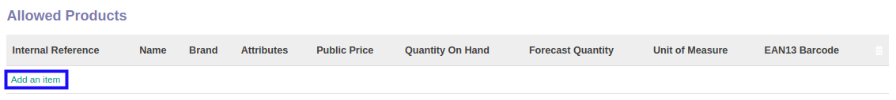
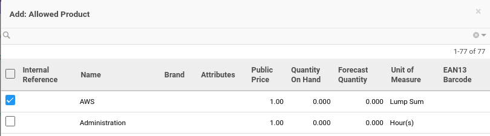
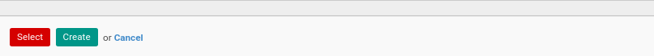

# Menambahkan Produk

*(Instruksi kerja ini merupakan sub instruksi dari (1) [Membuat Analytic Account](./membuat.md), atau (2) [Memodifikasi Analytic Account](./memodifikasi.md). Instruksi kerja ini tidak bisa berdiri sendiri)*

## A. INPUT

*(Tidak ada instruksi khusus)*

## B. LANGKAH KERJA

1. Klik label **Add an Item** pada bagian atas-kiri tabel ***Allowed Products***

Pop-up ***Allowed Products*** akan muncul.

2. Seleksi data produk.
3. Klik tombol **Select** pada bagian bawah-kiri pop-up ***Allowed Products***

4. Lanjutkan [langkah ke-21 instruksi kerja Membuat Analytic Account](./membuat.md#l21) atau [langkah ke-22 instruksi kerja Memodifikasi Analytic Account](./memodifikasi.md#l22).

## C. OUTPUT

*(Tidak ada instruksi khusus)*
