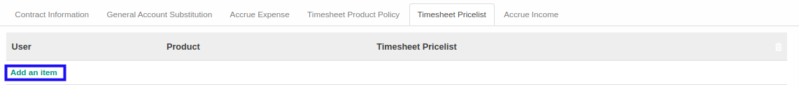

# Menambahkan Timesheet Pricelist

*(Instruksi kerja ini merupakan sub instruksi dari (1) [Membuat Analytic Account](./membuat.md), atau (2) [Memodifikasi Analytic Account](./memodifikasi.md). Instruksi kerja ini tidak bisa berdiri sendiri)*

## A. INPUT

*(Tidak ada instruksi khusus)*

## B. LANGKAH KERJA

1. Klik label **Add an Item** pada bagian atas-kiri tabel ***Timesheet Pricelist***

2. Pilih **[User](./penjelasan.md#field-timesheet-pricelist-user)**. Wajib diisi.
3. Pilih **[Product](./penjelasan.md#field-timesheet-pricelist-product)**. Wajib diisi.
4. Pilih **[Timesheet Pricelist](./penjelasan.md#field-timesheet-pricelist-pricelist)**. Wajib diisi.
5. Klik tombol **Save** pada bagian atas-kiri form.

6. Lanjutkan [langkah ke-23 instruksi kerja Membuat Analytic Account](./membuat.md#l23) atau [langkah ke-24 instruksi kerja Memodifikasi Analytic Account](./memodifikasi.md#l24).

## C. OUTPUT

*(Tidak ada instruksi khusus)*
