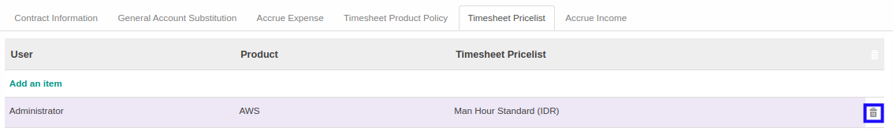

# Menghapus Timesheet Pricelist

*(Instruksi kerja ini merupakan sub instruksi dari (1) [Membuat Analytic Account](./membuat.md), atau (2) [Memodifikasi Analytic Account](./memodifikasi.md). Instruksi kerja ini tidak bisa berdiri sendiri)*

## A. INPUT

*(Tidak ada instruksi khusus)*

## B. LANGKAH KERJA

1. Klik icon tempat sampah pada bagian kanan data **Timesheet Pricelist** yang akan dihapus.

2. Ulangi langkah ke-1 untuk setiap *Timesheet Pricelist* yang akan dihapus.
3. Lanjutkan [langkah ke-23 instruksi kerja Membuat Analytic Account](./membuat.md#l23) atau [langkah ke-24 instruksi kerja Memodifikasi Analytic Account](./memodifikasi.md#l24).

## C. OUTPUT

*(Tidak ada instruksi khusus)*
