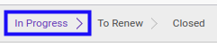
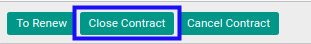
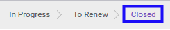

# Menyelesaikan Analytic Account

## A. INPUT

* Data *Analytic Account* yang dapat diselesaikan harus memiliki status **In Progress**.

* User yang akan menyelesaikan harus memiliki akses untuk menyelesaikan *Analytic Account*.

## B. LANGKAH KERJA

1. Buka menu **Accounting -> Configuration -> Analytic Accounting -> Analytic Account**. Abaikan jika sudah berada pada menu yang dimaksud.
2. Buka data *Analytic Account* yang akan diselesaikan. Abaikan jika data sudah dibuka.
3. Klik tombol **Close Contract** pada bagian atas-kiri form.

## C. OUTPUT

* Status dari *Analytic Account* akan berubah menjadi **Closed**.

