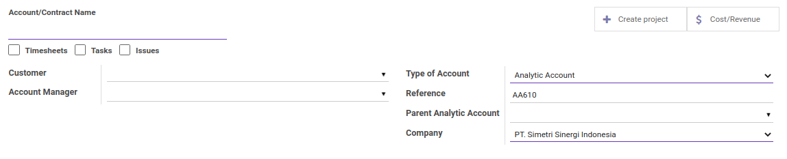
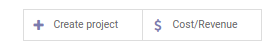
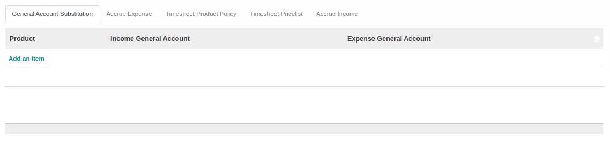
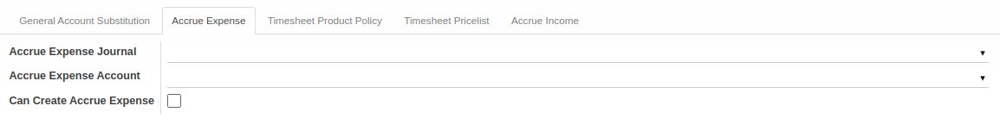
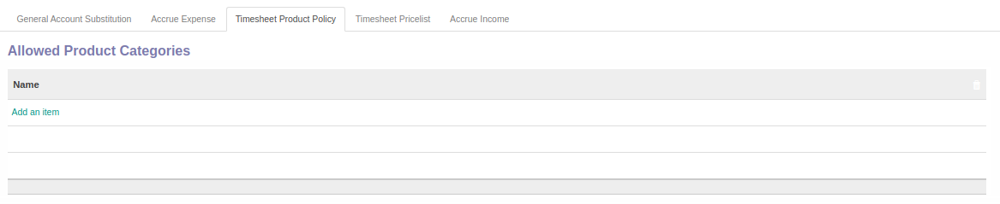
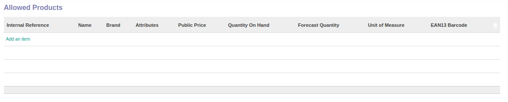
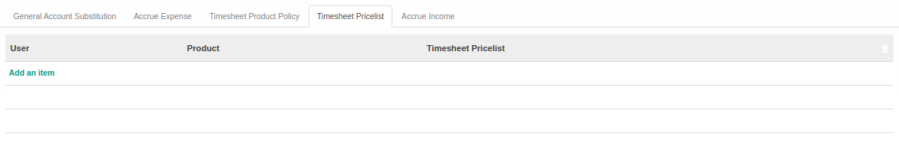
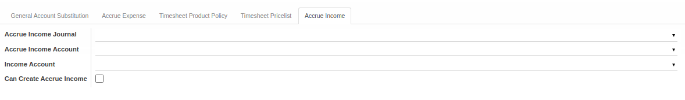

# Penjelasan Analytic Account

Informasi pada *Analytic Account* dibagi menjadi beberapa bagian, yaitu:

* [Header](#bagian-header)
* [Tab General Account Substitution](#tab-general-account)
* [Tab Accrue Expense](#tab-accrue-expense)
* [Tab Timesheet Product Policy](#tab-timesheet-product)
* [Tab Timesheet Pricelist](#tab-timesheet-pricelist)
* [Tab Accrue Income](#tab-accrue-income)

### <a name="bagian-header">HEADER</a>

#### <a name="field-header-account-name">Account/Contract Name</a>

Nama akun/produk.

#### <a name="field-header-timesheet">Timesheet</a>

to do.

#### <a name="field-header-tasks">Tasks</a>

to do.

#### <a name="field-header-issues">Issues</a>

to do.

#### <a name="field-header-account-smart-button">Smart Button</a>

Tombol-tombol yang berfungsi sebagai Shortcut untuk masuk ke dalam menu yang berkaitan dan juga sebagai pemberi informasi mengenai seberapa banyak data, total, dll

#### <a name="field-header-customer">Customer</a>

Nama klien.

#### <a name="field-header-account-mgr">Account Manager</a>

Nama penanggung jawab akun.

#### <a name="field-header-type-account">Type of Account</a>

Tipe akun.

#### <a name="field-header-reference">Reference</a>

Referensi.

#### <a name="field-header-parent-account">Parent Analytic Account</a>

Induk akun analitik.

#### <a name="field-header-company">Company</a>

Nama perusahaan.

#### <a name="tab-general-account">TAB GENERAL ACCOUNT SUBSTITUTION</a>

#### <a name="field-general-account-table">TABEL General Account Substitution</a>

Daftar produk dengan mapping akun substitusi.

#### <a name="field-general-account-product">Product</a>

Nama produk.

#### <a name="field-general-account-income">Income General Account</a>

Nama akun penerimaan.

#### <a name="field-general-account-expense">Expense General Account</a>

Nama akun pengeluaran.

#### <a name="tab-accrue-expense">TAB ACCRUE EXPENSE</a>

#### <a name="field-accrue-expense-journal">Accrue Expense Journal</a>

Nama jurnal accrue expense.

#### <a name="field-accrue-expense-account">Accrue Expense Account</a>

Nama akun accrue expense.

#### <a name="field-accrue-expense-create">Can Create Accrue Expense</a>

Sebagai penanda dapat membuat/tidak accrue expense.

#### <a name="tab-timesheet-product">TAB TIMESHEET PRODUCT POLICY</a>

#### <a name="field-timesheet-product-categories-table">TABEL Allowed Product Categories</a>

Daftar kategori produk yang diperbolehkan.

#### <a name="field-timesheet-product-categories-name">Name</a>

Nama kategori produk.

#### <a name="field-timesheet-product-product-table">TABEL Allowed Product</a>

Daftar produk yang diperbolehkan.

#### <a name="field-timesheet-product-reference">Internal Reference</a>

Referensi internal produk.

#### <a name="field-timesheet-product-name">Name</a>

Nama produk.

#### <a name="field-timesheet-product-brand">Brand</a>

Merk produk.

#### <a name="field-timesheet-product-attributes">Attributes</a>

Informasi atribut.

#### <a name="field-timesheet-product-public-price">Public Price</a>

Harga yang dipublikasi.

#### <a name="field-timesheet-product-qty-on-hand">Quantity On Hand</a>

Jumlah unit yang ada di perusahaan.

#### <a name="field-timesheet-product-qty-forecast">Forecast Quantity</a>

Jumlah unit yang diperkirakan.

#### <a name="field-timesheet-product-uom">Unit of Measure</a>

Satuan ukuran.

#### <a name="field-timesheet-product-barcode">EAN13 Barcode</a>

Informasi EAN13 barcode.

#### <a name="tab-timesheet-pricelist">TAB TIMESHEET PRICELIST</a>

#### <a name="field-timesheet-pricelist-table">TABEL Timesheet Pricelist</a>

Daftar user dan produk dengan standar harga.

#### <a name="field-timesheet-pricelist-user">User</a>

Nama user.

#### <a name="field-timesheet-pricelist-product">Product</a>

Nama produk.

#### <a name="field-timesheet-pricelist-pricelist">Timesheet Pricelist</a>

Daftar standar harga.

#### <a name="tab-accrue-income">TAB ACCRUE INCOME</a>

#### <a name="field-accrue-income-journal">Accrue Income Journal</a>

Nama jurnal accrue income.

#### <a name="field-accrue-income-account">Accrue Income Account</a>

Nama akun accrue income.

#### <a name="field-accrue-income-create">Can Create Accrue Income</a>

Sebagai penanda dapat membuat/tidak accrue income.
