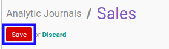

# Memodifikasi Analytic Journal

## A. INPUT

* User yang akan memodifikasi harus memiliki akses untuk memodifikasi *Analytic Journal*.

## B. LANGKAH KERJA

1. Buka menu **Accounting -> Configuration -> Analytic Accounting -> Analytic Journals**. Abaikan jika sudah berada pada menu yang dimaksud.
2. Buka data *Analytic Journal* yang akan dimodifikasi. Abaikan jika data sudah dibuka.
3. Klik tombol **Edit** pada bagian atas-kiri form.

4. Isi dan sesuaikan **[Journal Name](./penjelasan.md#field-journal-name)** jika dibutuhkan. Wajib diisi.
5. Pilih dan sesuaikan **[Type](./penjelasan.md#field-type)** jika dibutuhkan. Wajib diisi.
6. Pilih dan sesuaikan **[Company](./penjelasan.md#field-company)** jika dibutuhkan. Wajib diisi.
7. Isi dan sesuaikan **[Journal Code](./penjelasan.md#field-journal-code)** jika dibutuhkan. Tidak wajib diisi.
8. Klik tombol **Save** pada bagian atas-kiri form.

## C. OUTPUT

* Data *Analytic Journal* akan berubah sesuai dengan perubahan yang dilakukan.
