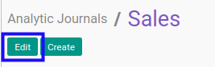

# Menonaktifkan Analytic Journal

* Data *Analytic Journal* yang akan dinonaktifkan harus memiliki status **Active**

## B. LANGKAH KERJA

1. Buka menu **Accounting -> Configuration -> Analytic Accounting -> Analytic Journals**. Abaikan jika sudah berada pada menu yang dimaksud.
2. Buka data *Analytic Journal* yang akan dinonaktifkan. Abaikan jika data sudah dibuka.
3. Klik tombol **Edit** pada bagian atas-kiri form.

4. Deaktifkan **[Active](./penjelasan.md#field-active)**.

5. Klik tombol **Save** pada bagian atas-kiri form.

## C. OUTPUT

* Data *Analytic Journal* akan non aktif.
