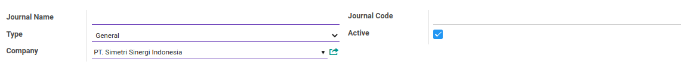

# Penjelasan Analytic Journal

Informasi pada *Analytic Journal* dibagi menjadi beberapa bagian, yaitu:

* [Header](#bagian-header)

### <a name="bagian-header">HEADER</a>

#### <a name="field-journal-name">Journal Name</a>

Nama jurnal.

#### <a name="field-type">Type</a>

Tipe jurnal.

#### <a name="field-company">Company</a>

Nama perusahaan.

#### <a name="field-journal-code">Journal Code</a>

Kode jurnal.

#### <a name="field-active">Active</a>

Sebagai penanda apakah data adalah aktif/non-aktif.
