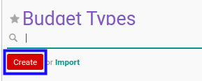

# Membuat Budget Type

## A. INPUT

*(Tidak ada instruksi khusus)*

## B. LANGKAH KERJA

1. Buka menu **Accounting -> Configuration -> Budget -> Budget Types**. Abaikan jika sudah berada pada menu yang dimaksud.
2. Klik tombol **Create** pada bagian atas-kiri form.

3. Isi **[Budget Type](./penjelasan.md#field-header-budget-type)**. Wajib diisi.
4. Isi **[Code](./penjelasan.md#field-header-code)**. Wajib diisi.
5. Beralih ke tab **[General Settings](./penjelasan.md#tab-general-setting)**.
6. Pilih **[Mode](./penjelasan.md#field-general-setting-mode)**. Wajib diisi.
7. Pilih **[Sequence](./penjelasan.md#field-general-setting-sequence)**. Tidak wajib diisi.
8. Beralih ke tab **[Allowed Accounts](./penjelasan.md#tab-allowed-account)**.
9. Pilih **[Allowed Accounts](./penjelasan.md#field-allowed-account-allowed)**. Tidak wajib diisi.
10. Beralih ke tab **[Workflow Policy](./penjelasan.md#tab-workflow-policy)**.
11. Pilih **[Allowed To Confirm Budget](./penjelasan.md#field-allow-to-confirm)**. Tidak wajib diisi.
12. Pilih **[Allowed To Restart Budget Approval](./penjelasan.md#field-allow-to-restart-approval)**. Tidak wajib diisi.
13. Pilih **[Allowed To Approve Budget](./penjelasan.md#field-allow-to-approve)**. Tidak wajib diisi.
14. Pilih **[Allowed To Cancel Budget](./penjelasan.md#field-allow-to-cancel)**. Tidak wajib diisi.
15. Pilih **[Allowed To Restart Budget](./penjelasan.md#field-allow-to-restart)**. Tidak wajib diisi.
16. Beralih ke tab **[Note](./penjelasan.md#tab-note)**.
17. Isi **[Note](./penjelasan.md#field-note)**. Tidak wajib diisi.
18. Klik tombol **Save** pada bagian atas-kiri form.

## C. OUTPUT

* Data *budget type* akan terbuat
