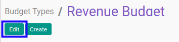
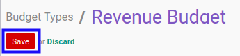

# Memodifikasi Budget Type

## A. INPUT

* User yang akan memodifikasi harus memiliki akses untuk memodifikasi *Budget Type*.

## B. LANGKAH KERJA

1. Buka menu **Accounting -> Configuration -> Budget -> Budget Types**. Abaikan jika sudah berada pada menu yang dimaksud.
2. Buka data *Budget Type* yang akan dimodifikasi. Abaikan jika data sudah dibuka.
3. Klik tombol **Edit** pada bagian atas-kiri form.

4. Isi dan sesuaikan **[Budget Type](./penjelasan.md#field-header-budget-type)** jika dibutuhkan. Wajib diisi.
5. Isi dan sesuaikan **[Code](./penjelasan.md#field-header-code)** jika dibutuhkan. Wajib diisi.
6. Beralih ke tab **[General Settings](./penjelasan.md#tab-general-setting)**.
7. Pilih dan sesuaikan **[Mode](./penjelasan.md#field-general-setting-mode)** jika dibutuhkan. Wajib diisi.
8. Pilih dan sesuaikan **[Sequence](./penjelasan.md#field-general-setting-sequence)** jika dibutuhkan. Tidak wajib diisi.
9. Beralih ke tab **[Allowed Accounts](./penjelasan.md#tab-allowed-account)**.
10. Pilih dan sesuaikan **[Allowed Accounts](./penjelasan.md#field-allowed-account-allowed)** jika dibutuhkan. Tidak wajib diisi.
11. Beralih ke tab **[Workflow Policy](./penjelasan.md#tab-workflow-policy)**.
12. Pilih dan sesuaikan **[Allowed To Confirm Budget](./penjelasan.md#field-allow-to-confirm)** jika dibutuhkan. Tidak wajib diisi.
13. Pilih dan sesuaikan **[Allowed To Restart Budget Approval](./penjelasan.md#field-allow-to-restart-approval)** jika dibutuhkan. Tidak wajib diisi.
14. Pilih dan sesuaikan **[Allowed To Approve Budget](./penjelasan.md#field-allow-to-approve)** jika dibutuhkan. Tidak wajib diisi.
15. Pilih dan sesuaikan **[Allowed To Cancel Budget](./penjelasan.md#field-allow-to-cancel)** jika dibutuhkan. Tidak wajib diisi.
16. Pilih dan sesuaikan **[Allowed To Restart Budget](./penjelasan.md#field-allow-to-restart)** jika dibutuhkan. Tidak wajib diisi.
17. Beralih ke tab **[Note](./penjelasan.md#tab-note)**.
18. Isi dan sesuaikan **[Note](./penjelasan.md#field-note)** jika dibutuhkan. Tidak wajib diisi.
19. Klik tombol **Save** pada bagian atas-kiri form.

## C. OUTPUT

* Data *Budget Type* akan berubah sesuai dengan perubahan yang dilakukan.
