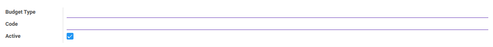
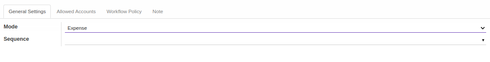
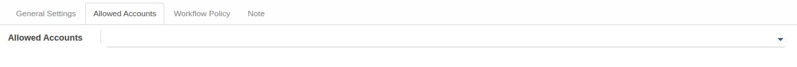
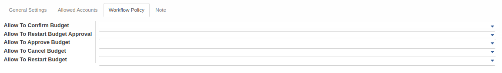
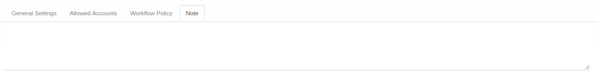

# Penjelasan Budget Type

Informasi pada *Budget Type* dibagi menjadi beberapa bagian, yaitu:

* [Header](#bagian-header)
* [Tab General Settings](#tab-general-setting)
* [Tab Allowed Accounts](#tab-allowed-account)
* [Tab Workflow Policy](#tab-workflow-policy)
* [Tab Note](#tab-note)

### <a name="bagian-header">HEADER</a>

#### <a name="field-header-budget-type">Budget Type</a>

Tipe budget.

#### <a name="field-header-code">Code</a>

Kode budget.

#### <a name="field-header-active">Active</a>

Sebagai penanda apakah data adalah aktif/non-aktif.

#### <a name="tab-general-setting">TAB GENERAL SETTINGS</a>

#### <a name="field-general-setting-mode">Mode</a>

Mode budget.

#### <a name="field-general-setting-sequence">Sequence</a>

Sequence yang digunakan.

#### <a name="tab-allowed-account">TAB ALLOWED ACCOUNTS</a>

#### <a name="field-allowed-account-allowed">Allowed Accounts</a>

Akun yang diperbolehkan.

#### <a name="tab-workflow-policy">TAB WORKFLOW POLICY</a>

#### <a name="field-allow-to-confirm">Allow To Confirm Budget</a>

Berhak/tidaknya user aktif untuk dapat mengkonfirmasi budget.

#### <a name="field-allow-to-restart-approval">Allow To Restart Budget Approval</a>

Berhak/tidaknya user aktif untuk dapat merestart persetujuan budget.

#### <a name="field-allow-to-approve">Allow To Approve Budget</a>

Berhak/tidaknya user aktif untuk dapat menyetujui budget.

#### <a name="field-allow-to-cancel">Allow To Cancel Budget</a>

Berhak/tidaknya user aktif untuk dapat membatalkan budget.

#### <a name="field-allow-to-restart">Allow To Restart Budget</a>

Berhak/tidaknya user aktif untuk dapat merestart budget.

#### <a name="tab-note">TAB NOTE</a>

#### <a name="field-note">Note</a>

Catatan.
