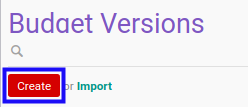

# Membuat Budget Version

## A. INPUT

*(Tidak ada instruksi khusus)*

## B. LANGKAH KERJA

1. Buka menu **Accounting -> Configuration -> Budget -> Budget Versions**. Abaikan jika sudah berada pada menu yang dimaksud.
2. Klik tombol **Create** pada bagian atas-kiri form.

3. Isi **[Budget Version](./penjelasan.md#field-header-budget-version)**. Wajib diisi.
4. Isi **[Code](./penjelasan.md#field-header-code)**. Wajib diisi.
5. Beralih ke tab **[Note](./penjelasan.md#tab-note)**.
6. Isi **[Note](./penjelasan.md#field-note)**. Tidak wajib diisi.
7. Klik tombol **Save** pada bagian atas-kiri form.

## C. OUTPUT

* Data *budget version* akan terbuat
