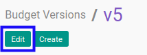
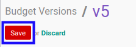

# Memodifikasi Budget Version

## A. INPUT

* User yang akan memodifikasi harus memiliki akses untuk memodifikasi *Budget Version*.

## B. LANGKAH KERJA

1. Buka menu **Accounting -> Configuration -> Budget -> Budget Versions**. Abaikan jika sudah berada pada menu yang dimaksud.
2. Buka data *Budget Version* yang akan dimodifikasi. Abaikan jika data sudah dibuka.
3. Klik tombol **Edit** pada bagian atas-kiri form.

4. Isi dan sesuaikan **[Budget Version](./penjelasan.md#field-header-budget-version)** jika dibutuhkan. Wajib diisi.
5. Isi dan sesuaikan **[Code](./penjelasan.md#field-header-code)** jika dibutuhkan. Wajib diisi.
6. Beralih ke tab **[Note](./penjelasan.md#tab-note)**.
7. Isi dan sesuaikan **[Note](./penjelasan.md#field-note)** jika dibutuhkan. Tidak wajib diisi.
8. Klik tombol **Save** pada bagian atas-kiri form.

## C. OUTPUT

* Data *Budget Version* akan berubah sesuai dengan perubahan yang dilakukan.
