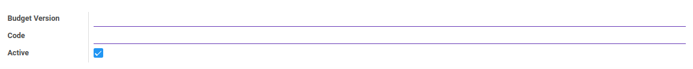
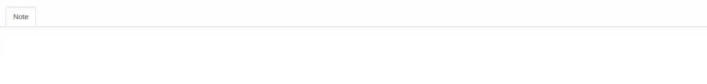

# Penjelasan Budget Version

Informasi pada *Budget Version* dibagi menjadi beberapa bagian, yaitu:

* [Header](#bagian-header)
* [Tab Note](#tab-note)

### <a name="bagian-header">HEADER</a>

#### <a name="field-header-budget-version">Budget Version</a>

Versi budget.

#### <a name="field-header-code">Code</a>

Kode versi budget.

#### <a name="field-header-active">Active</a>

Sebagai penanda apakah data adalah aktif/non-aktif.

#### <a name="tab-note">TAB NOTE</a>

#### <a name="field-note">Note</a>

Catatan.
