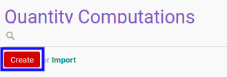

# Membuat Quantity Computation Method

## A. INPUT

*(Tidak ada instruksi khusus)*

## B. LANGKAH KERJA

1. Buka menu **Accounting -> Configuration -> Budget -> Quantity Computations**. Abaikan jika sudah berada pada menu yang dimaksud.
2. Klik tombol **Create** pada bagian atas-kiri form.

3. Isi **[Quantity Computation](./penjelasan.md#field-header-quantity-computation)**. Wajib diisi.
4. Isi **[Code](./penjelasan.md#field-header-code)**. Wajib diisi.
5. Beralih ke tab **[Python Code](./penjelasan.md#tab-python-code)**.
6. Isi **[Python Code](./penjelasan.md#field-python-code)**. Tidak wajib diisi.
7. Beralih ke tab **[Note](./penjelasan.md#tab-note)**.
8. Isi **[Note](./penjelasan.md#field-note)**. Tidak wajib diisi.
9. Klik tombol **Save** pada bagian atas-kiri form.

## C. OUTPUT

* Data *Quantity Computation Method* akan terbuat
