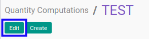

# Memodifikasi Quantity Computation Method

## A. INPUT

* User yang akan memodifikasi harus memiliki akses untuk memodifikasi *Quantity Computation Method*.

## B. LANGKAH KERJA

1. Buka menu **Accounting -> Configuration -> Budget -> Quantity Computations**. Abaikan jika sudah berada pada menu yang dimaksud.
2. Buka data *Quantity Computation Method* yang akan dimodifikasi. Abaikan jika data sudah dibuka.
3. Klik tombol **Edit** pada bagian atas-kiri form.

4. Isi dan sesuaikan **[Quantity Computation](./penjelasan.md#field-header-quantity-computation)** jika dibutuhkan. Wajib diisi.
5. Isi dan sesuaikan **[Code](./penjelasan.md#field-header-code)** jika dibutuhkan. Wajib diisi.
6. Beralih ke tab **[Python Code](./penjelasan.md#tab-python-code)**.
7. Isi dan sesuaikan **[Python Code](./penjelasan.md#field-python-code)** jika dibutuhkan. Tidak wajib diisi.
8. Beralih ke tab **[Note](./penjelasan.md#tab-note)**.
9. Isi dan sesuaikan **[Note](./penjelasan.md#field-note)** jika dibutuhkan. Tidak wajib diisi.
10. Klik tombol **Save** pada bagian atas-kiri form.

## C. OUTPUT

* Data *Quantity Computation Method* akan berubah sesuai dengan perubahan yang dilakukan.
