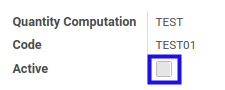

# Mengaktifkan Quantity Computation Method

## A. INPUT

* Data *Quantity Computation Method* yang dapat diaktifkan harus memiliki status **Non Active**.

* User yang akan mengaktifkan harus memiliki akses untuk mengaktifkan *Quantity Computation Method*.

## B. LANGKAH KERJA

1. Buka menu **Accounting -> Configuration -> Budget -> Quantity Computations**. Abaikan jika sudah berada pada menu yang dimaksud.
2. Buka data *Quantity Computation Method* yang akan diaktifkan. Abaikan jika data sudah dibuka.
3. Klik tombol **Edit** pada bagian atas-kiri form.

4. Aktifkan **[Active](./penjelasan.md#field-header-active)**.
5. Klik tombol **Save** pada bagian atas-kiri form.

## C. OUTPUT

* Data *Quantity Computation Method* akan aktif.
