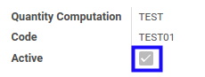

# Menonaktifkan Quantity Computation Method

## A. INPUT

* Data *Quantity Computation Method* yang dapat dinonaktifkan harus memiliki status **Active**.

* User yang akan menonaktifkan harus memiliki akses untuk menonaktifkan *Quantity Computation Method*.

## B. LANGKAH KERJA

1. Buka menu **Accounting -> Configuration -> Budget -> Quantity Computations**. Abaikan jika sudah berada pada menu yang dimaksud.
2. Buka data *Quantity Computation Method* yang akan dinonaktifkan. Abaikan jika data sudah dibuka.
3. Klik tombol **Edit** pada bagian atas-kiri form.

4. Deaktifkan **[Active](./penjelasan.md#field-header-active)**.
5. Klik tombol **Save** pada bagian atas-kiri form.

## C. OUTPUT

* Data *Quantity Computation Method* akan non aktif.
