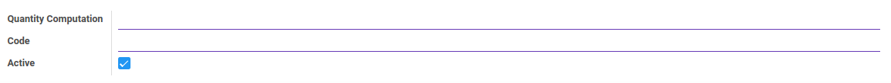
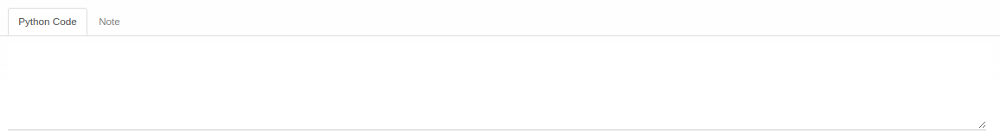
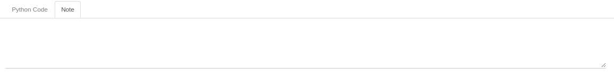

# Penjelasan Quantity Computation Method

Informasi pada *Quantity Computation Method* dibagi menjadi beberapa bagian, yaitu:

* [Header](#bagian-header)
* [Tab Python Code](#tab-python-code)
* [Tab Note](#tab-note)

### <a name="bagian-header">HEADER</a>

#### <a name="field-header-quantity-computation">Quantity Computation</a>

Nama metode quantity computation.

#### <a name="field-header-code">Code</a>

Kode metode quantity computation.

#### <a name="field-header-active">Active</a>

Sebagai penanda apakah data adalah aktif/non-aktif.

#### <a name="tab-python-code">TAB PYTHON CODE</a>

#### <a name="field-python-code">Python Code</a>

Kode python untuk quantity computation.

#### <a name="tab-note">TAB NOTE</a>

#### <a name="field-note">Note</a>

Catatan.
