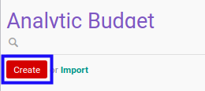

# Membuat Analytic Budget

## A. INPUT

*(Tidak ada instruksi khusus)*

## B. LANGKAH KERJA

1. Buka menu **Accounting -> Budget -> Analytic Budget**. Abaikan jika sudah berada pada menu yang dimaksud.
2. Klik tombol **Create** pada bagian atas-kiri form.

3. Ubah **[# Analytic Budget](./penjelasan.md#field-no-analytic-budget)** dengan penomeran yang dikehendaki. Biarkan berisi **/** apabila menghendaki penomeran otomatis.
4. Pilih **[Company](./penjelasan.md#field-company)**. Wajib diisi.
5. Pilih **[Type](./penjelasan.md#field-type)**. Wajib diisi.
6. Pilih **[Responsible](./penjelasan.md#field-responsible)**. Wajib diisi.
7. Pilih **[Analytic Account](./penjelasan.md#field-analytic-account)**. Wajib diisi.
8. Beralih ke tab **[Budget Detail](./penjelasan.md#tab-budget-detail)**.
9. <a name="l9">[Tambah](./menambahkan-revenue.md)/[Modifikasi](./memodifikasi-revenue.md)/[Hapus](./menghapus-revenue.md) **Revenue**</a>. Ulangi langkah ini sampai **Revenue** sesuai dengan keinginan.
10. <a name="l10">[Tambah](./menambahkan-cost.md)/[Modifikasi](./memodifikasi-cost.md)/[Hapus](./menghapus-cost.md) **Cost**</a>. Ulangi langkah ini sampai **Cost** sesuai dengan keinginan.
11. Beralih ke tab **[Notes](./penjelasan.md#tab-notes)**.
12. Isi **[Notes](./penjelasan.md#field-notes)**. Tidak wajib diisi.
13. Klik tombol **Save** pada bagian atas-kiri form.

## C. OUTPUT

* Data *analytic budget* akan terbuat dengan status **Draft**

