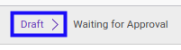
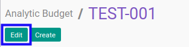
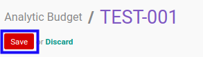

# Memodifikasi Analytic Budget

## A. INPUT

* Data *Analytic Budget* yang dapat dimodifikasi harus memiliki status **Draft**.

* User yang akan memodifikasi harus memiliki akses untuk memodifikasi *Analytic Budget*.

## B. LANGKAH KERJA

1. Buka menu **Accounting -> Budget -> Analytic Budget**. Abaikan jika sudah berada pada menu yang dimaksud.
2. Buka data *Analytic Budget* yang akan dimodifikasi. Abaikan jika data sudah dibuka.
3. Klik tombol **Edit** pada bagian atas-kiri form.

4. Ubah **[# Analytic Budget](./penjelasan.md#field-no-analytic-budget)** jika dibutuhkan. Wajib diisi.
5. Pilih dan sesuaikan **[Company](./penjelasan.md#field-company)** jika dibutuhkan. Wajib diisi.
6. Pilih dan sesuaikan **[Type](./penjelasan.md#field-type)** jika dibutuhkan. Wajib diisi.
7. Pilih dan sesuaikan **[Responsible](./penjelasan.md#field-responsible)** jika dibutuhkan. Wajib diisi.
8. Pilih dan sesuaikan **[Analytic Account](./penjelasan.md#field-analytic-account)** jika dibutuhkan. Wajib diisi.
9. Beralih ke tab **[Budget Detail](./penjelasan.md#tab-budget-detail)**.
10. <a name="l10">[Tambah](./menambahkan-revenue.md)/[Modifikasi](./memodifikasi-revenue.md)/[Hapus](./menghapus-revenue.md) **Revenue**</a>. Ulangi langkah ini sampai **Revenue** sesuai dengan keinginan.
11. <a name="l11">[Tambah](./menambahkan-cost.md)/[Modifikasi](./memodifikasi-cost.md)/[Hapus](./menghapus-cost.md) **Cost**</a>. Ulangi langkah ini sampai **Cost** sesuai dengan keinginan.
12. Beralih ke tab **[Reviews](./penjelasan.md#tab-reviews)**.
13. Pilih dan sesuaikan **[Definition](./penjelasan.md#field-definition)** jika dibutuhkan. Tidak wajib diisi.
14. Beralih ke tab **[Notes](./penjelasan.md#tab-notes)**.
15. Isi dan sesuaikan **[Notes](./penjelasan.md#field-notes)** jika dibutuhkan. Tidak wajib diisi.
16. Klik tombol **Save** pada bagian atas-kiri form.

## C. OUTPUT

* Data *Analytic Budget* akan berubah sesuai dengan perubahan yang dilakukan.
