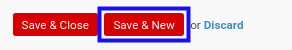

# Menambahkan Revenue

*(Instruksi kerja ini merupakan sub instruksi dari (1) [Membuat Analytic Budget](./membuat.md), atau (2) [Memodifikasi Analytic Budget](./memodifikasi.md). Instruksi kerja ini tidak bisa berdiri sendiri)*

## A. INPUT

*(Tidak ada instruksi khusus)*

## B. LANGKAH KERJA

1. Klik label **Add an Item** pada bagian atas-kiri tabel ***Revenues***

Pop-up ***Detail Revenue*** akan muncul.

2. Pilih **[Account](./penjelasan.md#field-budget-revenue-account)**. Wajib diisi.
3. Pilih **[Product](./penjelasan.md#field-budget-revenue-product)**. Tidak wajib diisi.
4. Isi **[Description](./penjelasan.md#field-budget-revenue-description)**. Wajib diisi.
5. Pilih **[Pricelist](./penjelasan.md#field-budget-revenue-pricelist)**. Tidak wajib diisi.
6. Isi **[Amount Per Unit](./penjelasan.md#field-budget-revenue-amount-per-unit)**. Wajib diisi.
7. Isi **[Qty](./penjelasan.md#field-budget-revenue-qty)**. Wajib diisi.
8. Pilih **[UoM](./penjelasan.md#field-budget-revenue-uom)**. Tidak wajib diisi.
9. Klik tombol **Save & Close** pada bagian bawah-kiri pop-up **Detail Revenue** untuk menyimpan data. Klik tombol **Save & New** pada bagian bawah-kiri pop-up **Detail Revenue** untuk menyimpan data dan menambahkan data baru.

10. Ulangi langkah ke-2 jika pada langkah ke-9 tombol **Save & New** yang dipilih.
11. Lanjutkan [langkah ke-9 instruksi kerja Membuat Analytic Budget](./membuat.md#l9) atau [langkah ke-10 instruksi kerja Memodifikasi Anallytic Budget](./memodifikasi.md#l10).

## C. OUTPUT

*(Tidak ada instruksi khusus)*
