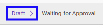

# Merestart Analytic Budget

## A. INPUT

* Data *Analytic Budget* yang akan direstart harus memiliki status **Cancel**.

* User yang akan merestart harus memiliki akses untuk merestart *Analytic Budget*.

## B. LANGKAH KERJA

1. Buka menu **Accounting -> Budget -> Analytic Budget**. Abaikan jika sudah berada pada menu yang dimaksud.
2. Buka data *Analytic Budget* yang akan direstart. Abaikan jika data sudah dibuka.
3. Klik tombol **Restart** pada bagian atas-kiri form.

4. Klik tombol **Ok** pada *pop-up* konfirmasi restart yang muncul.

## C. OUTPUT

* Status dari *Analytic Budget* akan berubah menjadi **Draft**.

* *Analytic Budget* dapat kembali dimodifikasi.
