# Penjelasan Analytic Budget

Informasi pada *Analytic Budget* dibagi menjadi beberapa bagian, yaitu:

* [Header](#bagian-header)
* [Tab Budget Detail](#tab-budget-detail)
* [Tab Realization](#tab-realization)
* [Tab Reviews](#tab-reviews)
* [Tab Notes](#tab-notes)
* [Tab Policies](#tab-policies)
* [Tab Logs](#tab-logs)

### <a name="bagian-header">HEADER</a>

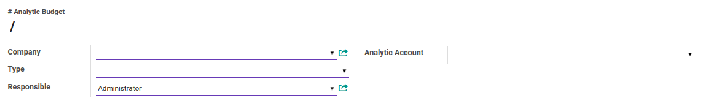

#### <a name="field-no-analytic-budget"># Analytic Budget</a>

Nomor analytic budget.

#### <a name="field-company">Company</a>

Nama perusahaan.

#### <a name="field-type">Type</a>

Tipe analytic budget.

#### <a name="field-responsible">Responsible</a>

Nama penanggung jawab analytic budget.

#### <a name="field-analytic-account">Analytic Account</a>

Akun analitik.

#### <a name="tab-budget-detail">TAB BUDGET DETAIL</a>

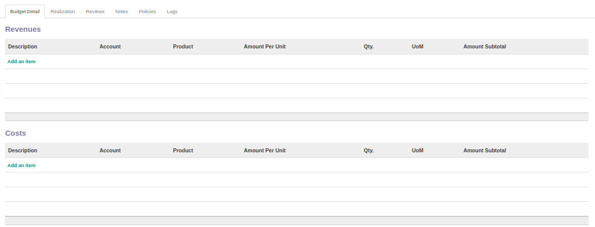
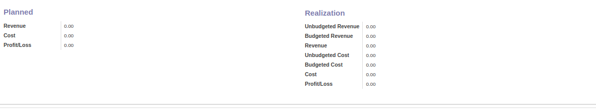

#### <a name="field-budget-revenue-table">TABEL Revenues</a>

Daftar detail revenue yang termasuk dalam budget.

*Pop Up Revenue* saat *add an item* diklik.

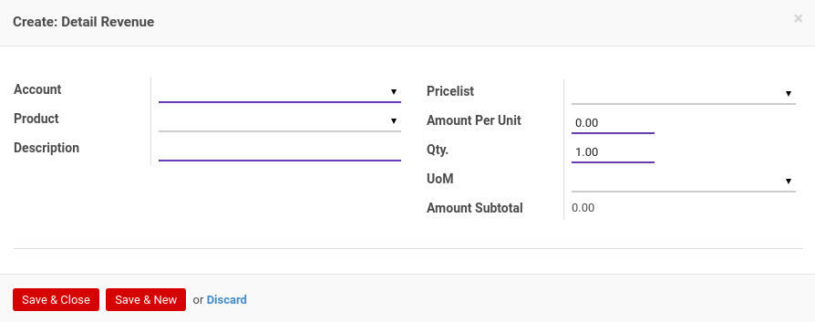

#### <a name="field-budget-revenue-account">Account</a>

Nama akun.

#### <a name="field-budget-revenue-product">Product</a>

Nama produk.

#### <a name="field-budget-revenue-description">Description</a>

Deskripsi.

#### <a name="field-budget-revenue-pricelist">Pricelist</a>

Daftar harga yang digunakan untuk revenue.

#### <a name="field-budget-revenue-amount-per-unit">Amount Per Unit</a>

Jumlah harga per unit.

#### <a name="field-budget-revenue-qty">Qty</a>

Jumlah unit.

#### <a name="field-budget-revenue-uom">UOM</a>

Satuan unit perhitungan.

#### <a name="field-budget-revenue-amount-subtotal">Amount Subtotal</a>

Jumlah subtotal.

#### <a name="field-budget-cost-table">TABEL Cost</a>

Daftar detail cost yang termasuk dalam budget.

*Pop Up Cost* saat *add an item* diklik.

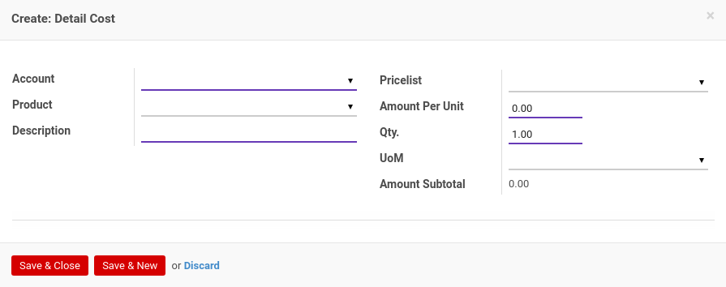

#### <a name="field-budget-cost-account">Account</a>

Nama akun.

#### <a name="field-budget-cost-product">Product</a>

Nama produk.

#### <a name="field-budget-cost-description">Description</a>

Deskripsi.

#### <a name="field-budget-cost-pricelist">Pricelist</a>

Daftar harga yang digunakan untuk cost.

#### <a name="field-budget-cost-amount-per-unit">Amount Per Unit</a>

Jumlah harga per unit.

#### <a name="field-budget-cost-qty">Qty</a>

Jumlah unit.

#### <a name="field-budget-cost-uom">UOM</a>

Satuan unit perhitungan.

#### <a name="field-budget-cost-amount-subtotal">Amount Subtotal</a>

Jumlah subtotal.

#### <a name="field-budget-detail-planned">PLANNED</a>

#### <a name="field-budget-detail-planned-revenue">Revenue</a>

Jumlah rencana revenue.

#### <a name="field-budget-detail-planned-cost">Cost</a>

Jumlah rencana cost.

#### <a name="field-budget-detail-planned-profit-loss">Profit/Loss</a>

Jumlah rencana profit/loss.

#### <a name="field-budget-detail-realization">REALIZATION</a>

#### <a name="field-budget-detail-realization-unbudgeted-revenue">Unbudgeted Revenue</a>

Jumlah realisasi revenue yang tidak termasuk budget.

#### <a name="field-budget-detail-realization-budgeted-revenue">Budgeted Revenue</a>

Jumlah realisasi revenue yang termasuk budget.

#### <a name="field-budget-detail-realization-revenue">Revenue</a>

Jumlah realisasi total revenue.

#### <a name="field-budget-detail-realization-unbudgeted-cost">Unbudgeted Cost</a>

Jumlah realisasi cost yang tidak termasuk budget.

#### <a name="field-budget-detail-realization-budgeted-cost">Budgeted Cost</a>

Jumlah realisasi cost yang termasuk budget.

#### <a name="field-budget-detail-realization-cost">Cost</a>

Jumlah realisasi total cost.

#### <a name="field-budget-detail-realization-profit-loss">Profit/Loss</a>

Jumlah realisasi profit/loss.

#### <a name="tab-realization">TAB REALIZATION</a>

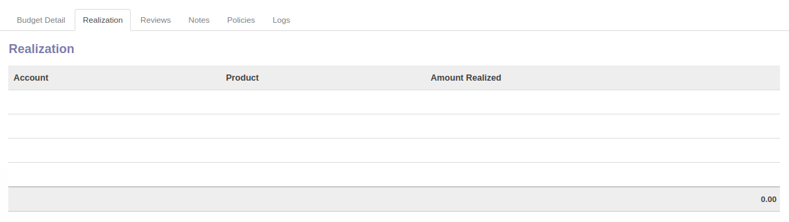
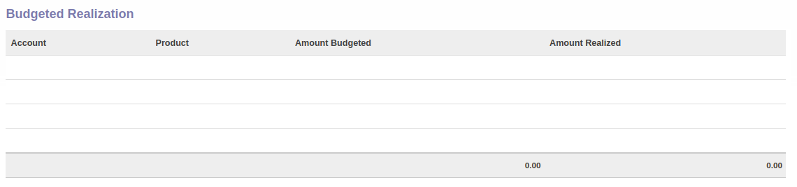

#### <a name="field-realization-realization-table">TABEL Realization</a>

Daftar total realisasi.

#### <a name="field-realization-realization-account">Account</a>

Nama akun.

#### <a name="field-realization-realization-product">Product</a>

Nama produk.

#### <a name="field-realization-realization-amount">Amount Realized</a>

Jumlah realisasi.

#### <a name="field-realization-budgeted-realization-table">TABEL Budgeted Realization</a>

Daftar realisasi yang termasuk budget.

#### <a name="field-realization-budgeted-realization-account">Account</a>

Nama akun.

#### <a name="field-realization-budgeted-realization-product">Product</a>

Nama produk.

#### <a name="field-realization-budgeted-realization-amount-budgeted">Amount Budgeted</a>

Jumlah budget.

#### <a name="field-realization-budgeted-realization-amount-realized">Amount Realized</a>

Jumlah realisasi.

#### <a name="field-realization-unbudgeted-realization-table">TABEL Unbudgeted Realization</a>

Daftar realisasi yang tidak termasuk budget.

#### <a name="field-realization-unbudgeted-realization-account">Account</a>

Nama akun.

#### <a name="field-realization-unbudgeted-realization-product">Product</a>

Nama produk.

#### <a name="field-realization-unbudgeted-realization-amount">Amount Realized</a>

Jumlah realisasi.

#### <a name="tab-reviews">TAB REVIEWS</a>

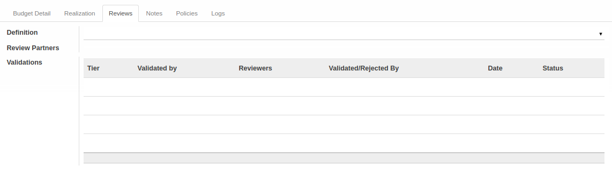

#### <a name="field-definition">Definition</a>

Template multiple approval yang digunakan.

#### <a name="field-review-partners-validations">Review Partners Validations</a>

Nama-nama user yang dapat menyetujui/menolak *analytic budget*.

#### <a name="tabel-validations">TABEL Validations</a>

Tahapan-tahapan persetujuan *analytic budget*.

#### <a name="field-validations-tier">Tier</a>

Urutan persetujuan.

#### <a name="field-validations-validated-by">Validated By</a>

Metode pemilihan user-user yang dapat menyetujui/menolak *analytic budget*. Metode pemilihan terdiri dari 3 (tiga) yaitu:

1. *Specific user*. User-user yang dapat menyetujui/menolak *analytic budget* ditentukan langsung.
2. *Any user in specific group*. User-user yang dapat menyetujui/menolak *analytic budget* adalah user-user yang tergabung dalam kelompok-kelompok user yang ditentukan.
3. *Both specific user and group*. User-user yang dapat menyetujui/menolak *analytic budget* ditentukan langsung ditambah dengan user-user yang tergabung dalam kelompok-kelompok user yang ditentukan.
4. *Python code*. User-user yang dapat menyetujui/menolak *analytic budget* ditentukan oleh algoritma kode python tertentu.

#### <a name="field-validations-reviewers">Reviewers</a>

Nama-nama user yang dapat menyetujui/menolak *analytic budget* pada *tier* yang dimaksud.

#### <a name="field-validations-validated-rejected">Validated/Rejected By</a>

User yang menyetujui/menolak *analytic budget*.

#### <a name="field-validations-date">Date</a>

Tanggal dan waktu **Validated/Rejected By** menyetujui/menolak *analytic budget*

#### <a name="field-validations-date">Status</a>

Status persetujuan, terdiri dari 2 (dua) kemungkinan:

1. **Approved**. Tier disetujui.
2. **Rejected**. Tier ditolak.

#### <a name="tab-notes">TAB NOTES</a>

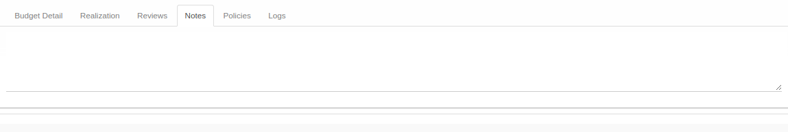

#### <a name="field-notes">Notes</a>

Catatan.

#### <a name="tab-policies">TAB POLICIES</a>

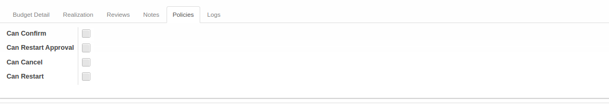

#### <a name="field-can-confirm">Can Confirm</a>

Berhak/tidaknya user aktif untuk dapat mengkonfirmasi analytic budget.

#### <a name="field-can-restart-approval">Can Restart Approval</a>

Berhak/tidaknya user aktif untuk dapat merestart persetujuan analytic budget.

#### <a name="field-can-cancel">Can Cancel</a>

Berhak/tidaknya user aktif untuk dapat membatalkan analytic budget.

#### <a name="field-can-restart">Can Restart</a>

Berhak/tidaknya user aktif untuk dapat merestart analytic budget.

#### <a name="tab-logs">TAB LOGS</a>

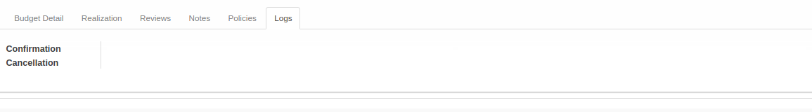

#### <a name="field-logs-confirmation">Confirmation</a>

Waktu konfirmasi dan user yang mengkonfirmasi analytic budget.

#### <a name="field-logs-cancellation">Cancellation</a>

Waktu batal dan user yang membatalkan analytic budget.
