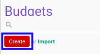
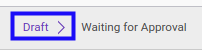

# Membuat Financial Budget

## A. INPUT

*(Tidak ada instruksi khusus)*

## B. LANGKAH KERJA

1. Buka menu **Accounting -> Budget -> Budget**. Abaikan jika sudah berada pada menu yang dimaksud.
2. Klik tombol **Create** pada bagian atas-kiri form.

3. Ubah **[# Budget](./penjelasan.md#field-no-budget)** dengan penomeran yang dikehendaki. Biarkan berisi **/** apabila menghendaki penomeran otomatis.
4. Pilih **[Type](./penjelasan.md#field-type)**. Wajib diisi.
5. Pilih **[Responsible](./penjelasan.md#field-responsible)**. Wajib diisi.
6. Pilih **[Version](./penjelasan.md#field-version)**. Wajib diisi.
7. Pilih **[Period](./penjelasan.md#field-period)**. Wajib diisi.
8. Beralih ke tab **[Budget Detail](./penjelasan.md#tab-budget-detail)**.
9. <a name="l9">[Tambah](./menambahkan-item-budget.md)/[Modifikasi](./memodifikasi-item-budget.md)/[Hapus](./menghapus-item-budget.md) **Items**</a>. Ulangi langkah ini sampai **Items** sesuai dengan keinginan.
10. Beralih ke tab **[Notes](./penjelasan.md#tab-notes)**.
11. Isi **[Notes](./penjelasan.md#field-notes)**. Tidak wajib diisi.
12. Klik tombol **Save** pada bagian atas-kiri form.

## C. OUTPUT

* Data *budget* akan terbuat dengan status **Draft**

