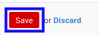

# Memodifikasi Item Budget

*(Instruksi kerja ini merupakan sub instruksi dari (1) [Membuat Financial Budget](./membuat.md), atau (2) [Memodifikasi Financial Budget](./memodifikasi.md). Instruksi kerja ini tidak bisa berdiri sendiri)*

## A. INPUT

*(Tidak ada instruksi khusus)*

## B. LANGKAH KERJA

1. Buka data **Item Budget** yang akan dimodifikasi.
2. Pilih dan sesuaikan **[Account](./penjelasan.md#field-budget-items-account)** jika dibutuhkan. Wajib diisi.
3. Pilih dan sesuaikan **[Product](./penjelasan.md#field-budget-items-product)** jika dibutuhkan. Tidak wajib diisi.
4. Isi dan sesuaikan **[Description](./penjelasan.md#field-budget-items-description)** jika dibutuhkan. Wajib diisi.
5. Pilih dan sesuaikan **[Pricelist](./penjelasan.md#field-budget-items-pricelist)** jika dibutuhkan. Tidak wajib diisi.
6. Isi dan sesuaikan **[Amount Per Unit](./penjelasan.md#field-budget-items-amount-per-unit)** jika dibutuhkan. Wajib diisi.
7. Pilih dan sesuaikan **[Quantity Computation](./penjelasan.md#field-budget-items-quantity-computation)** jika dibutuhkan. Tidak wajib diisi.
8. Isi dan sesuaikan **[Qty](./penjelasan.md#field-budget-items-qty)** jika dibutuhkan. Wajib diisi.
9. Pilih dan sesuaikan **[UoM](./penjelasan.md#field-budget-items-uom)** jika dibutuhkan. Tidak wajib diisi.
10. Beralih ke tab **[Cash Realization](./penjelasan.md#field-budget-items-tab-cash-realization)**.
11. <a name="l11">[Tambah](./menambahkan-cash-realization.md)/[Modifikasi](./memodifikasi-cash-realization.md)/[Hapus](./menghapus-cash-realization.md) **Cash Realization**</a>. Ulangi langkah ini sampai **Cash Realization** sesuai dengan keinginan.
12. Klik tombol **Save** pada bagian bawah-kiri form.

13. Lanjutkan [langkah ke-9 instruksi kerja Membuat Financial Budget](./membuat.md#l9) atau [langkah ke-10 instruksi kerja Memodifikasi Financial Budget](./memodifikasi.md#l10).

## C. OUTPUT

*(Tidak ada instruksi khusus)*
