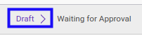

# Memodifikasi Financial Budget

## A. INPUT

* Data *Financial Budget* yang dapat dimodifikasi harus memiliki status **Draft**.

* User yang akan memodifikasi harus memiliki akses untuk memodifikasi *Financial Budget*.

## B. LANGKAH KERJA

1. Buka menu **Accounting -> Budget -> Budget**. Abaikan jika sudah berada pada menu yang dimaksud.
2. Buka data *Financial Budget* yang akan dimodifikasi. Abaikan jika data sudah dibuka.
3. Klik tombol **Edit** pada bagian atas-kiri form.

4. Ubah **[# Budget](./penjelasan.md#field-no-budget)** jika dibutuhkan. Wajib diisi.
5. Pilih dan sesuaikan **[Type](./penjelasan.md#field-type)** jika dibutuhkan. Wajib diisi.
6. Pilih dan sesuaikan **[Responsible](./penjelasan.md#field-responsible)** jika dibutuhkan. Wajib diisi.
7. Pilih dan sesuaikan **[Version](./penjelasan.md#field-version)** jika dibutuhkan. Wajib diisi.
8. Pilih dan sesuaikan **[Period](./penjelasan.md#field-period)** jika dibutuhkan. Wajib diisi.
9. Beralih ke tab **[Budget Detail](./penjelasan.md#tab-budget-detail)**.
10. <a name="l10">[Tambah](./menambahkan-item-budget.md)/[Modifikasi](./memodifikasi-item-budget.md)/[Hapus](./menghapus-item-budget.md) **Items**</a>. Ulangi langkah ini sampai **Items** sesuai dengan keinginan.
11. Beralih ke tab **[Reviews](./penjelasan.md#tab-reviews)**.
12. Pilih dan sesuaikan **[Definition](./penjelasan.md#field-definition)** jika dibutuhkan. Tidak wajib diisi.
13. Beralih ke tab **[Notes](./penjelasan.md#tab-notes)**.
14. Isi dan sesuaikan **[Notes](./penjelasan.md#field-notes)** jika dibutuhkan. Tidak wajib diisi.
15. Klik tombol **Save** pada bagian atas-kiri form.

## C. OUTPUT

* Data *Financial Budget* akan berubah sesuai dengan perubahan yang dilakukan.
