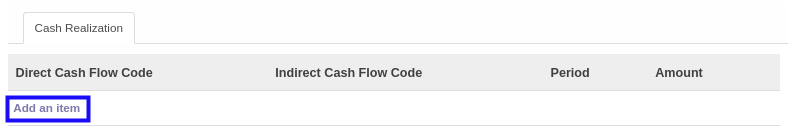

# Menambahkan Cash Realization

*(Instruksi kerja ini merupakan sub instruksi dari (1) [Menambahkan Item Budget](./menambahkan-item-budget.md), atau (2) [Memodifikasi Item Budget](./memodifikasi-item-budget.md). Instruksi kerja ini tidak bisa berdiri sendiri)*

## A. INPUT

*(Tidak ada instruksi khusus)*

## B. LANGKAH KERJA

1. Klik label **Add an Item** pada bagian atas-kiri tabel ***Cash Realization***

2. Pilih **[Direct Cash Flow Code](./penjelasan.md#field-budget-items-tab-cash-direct)**. Wajib diisi.
3. Pilih **[Indirect Cash Flow Code](./penjelasan.md#field-budget-items-tab-cash-indirect)**. Wajib diisi.
4. Pilih **[Period](./penjelasan.md#field-budget-items-tab-cash-period)**. Wajib diisi.
5. Isi **[Amount](./penjelasan.md#field-budget-items-tab-cash-amount)**. Wajib diisi.
6. Klik tombol **Save & Close** pada bagian bawah-kiri pop-up **Details** untuk menyimpan data. Klik tombol **Save & New** pada bagian bawah-kiri pop-up **Details** untuk menyimpan data dan menambahkan data baru.

9. Ulangi mulai langkah ke-1 jika pada langkah ke-6 tombol **Save & New** yang dipilih.
10. Lanjutkan [langkah ke-11 instruksi kerja Menambahkan Item Budget](./menambahkan-item-budget.md#l11) atau [langkah ke-11 instruksi kerja Memodifikasi Item Budget](./memodifikasi-item-budget.md#l11).

## C. OUTPUT

*(Tidak ada instruksi khusus)*
