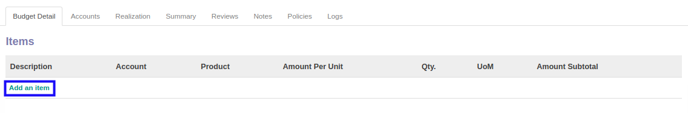
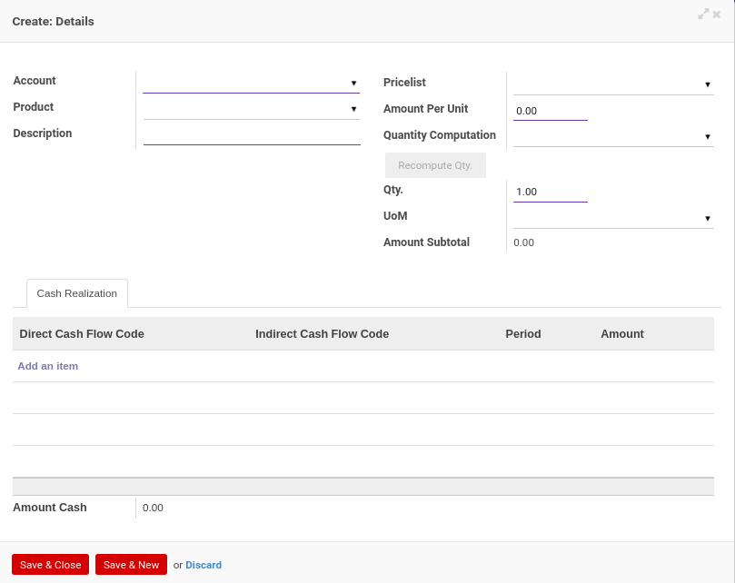

# Menambahkan Item Budget

*(Instruksi kerja ini merupakan sub instruksi dari (1) [Membuat Financial Budget](./membuat.md), atau (2) [Memodifikasi Financial Budget](./memodifikasi.md). Instruksi kerja ini tidak bisa berdiri sendiri)*

## A. INPUT

*(Tidak ada instruksi khusus)*

## B. LANGKAH KERJA

1. Klik label **Add an Item** pada bagian atas-kiri tabel ***Items Budget***

Pop-up ***Details*** akan muncul.

2. Pilih **[Account](./penjelasan.md#field-budget-items-account)**. Wajib diisi.
3. Pilih **[Product](./penjelasan.md#field-budget-items-product)**. Tidak wajib diisi.
4. Isi **[Description](./penjelasan.md#field-budget-items-description)**. Wajib diisi.
5. Pilih **[Pricelist](./penjelasan.md#field-budget-items-pricelist)**. Tidak wajib diisi.
6. Isi **[Amount Per Unit](./penjelasan.md#field-budget-items-amount-per-unit)**. Wajib diisi.
7. Pilih **[Quantity Computation](./penjelasan.md#field-budget-items-quantity-computation)**. Tidak wajib diisi.
8. Isi **[Qty](./penjelasan.md#field-budget-items-qty)**. Wajib diisi.
9. Pilih **[UoM](./penjelasan.md#field-budget-items-uom)**. Tidak wajib diisi.
10. Beralih ke tab **[Cash Realization](./penjelasan.md#field-budget-items-tab-cash-realization)**.
11. <a name="l11">[Tambah](./menambahkan-cash-realization.md)/[Modifikasi](./memodifikasi-cash-realization.md)/[Hapus](./menghapus-cash-realization.md) **Cash Realization**</a>. Ulangi langkah ini sampai **Cash Realization** sesuai dengan keinginan.
12. Klik tombol **Save & Close** pada bagian bawah-kiri pop-up **Details** untuk menyimpan data. Klik tombol **Save & New** pada bagian bawah-kiri pop-up **Details** untuk menyimpan data dan menambahkan data baru.

13. Ulangi langkah ke-2 jika pada langkah ke-12 tombol **Save & New** yang dipilih.
14. Lanjutkan [langkah ke-9 instruksi kerja Membuat Financial Budget](./membuat.md#l9) atau [langkah ke-10 instruksi kerja Memodifikasi Financial Budget](./memodifikasi.md#l10).

## C. OUTPUT

*(Tidak ada instruksi khusus)*
