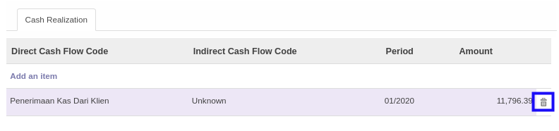

# Menghapus Cash Realization

*(Instruksi kerja ini merupakan sub instruksi dari (1) [Menambahkan Item Budget](./menambahkan-item-budget.md), atau (2) [Memodifikasi Item Budget](./memodifikasi-item-budget.md). Instruksi kerja ini tidak bisa berdiri sendiri)*

## A. INPUT

*(Tidak ada instruksi khusus)*

## B. LANGKAH KERJA

1. Klik icon tempat sampah pada bagian kanan data **Cash Realization** yang akan dihapus.

2. Lanjutkan [langkah ke-11 instruksi kerja Menambahkan Item Budget](./menambahkan-item-budget.md#l11) atau [langkah ke-11 instruksi kerja Memodifikasi Item Budget](./memodifikasi-item-budget.md#l11).

## C. OUTPUT

*(Tidak ada instruksi khusus)*
