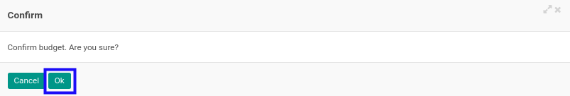

# Mengkonfirmasi Financial Budget

## A. INPUT

* Data *Financial Budget* yang dapat dikonfirmasi harus memiliki status **Draft**.

* User yang akan mengkonfirmasi harus memiliki akses untuk mengkonfirmasi *Financial Budget*.

## B. LANGKAH KERJA

1. Buka menu **Accounting -> Budget -> Budget**. Abaikan jika sudah berada pada menu yang dimaksud.
2. Buka data *Financial Budget* yang akan dikonfirmasi. Abaikan jika data sudah dibuka.
3. Klik tombol **Confirm** pada bagian atas-kiri form.

4. Klik tombol **Ok** pada *pop-up* konfirmasi confirm yang muncul.

## C. OUTPUT

* Status dari *Financial Budget* akan berubah menjadi **Waiting for Approval**.

* Isian *Financial Budget* sudah tidak bisa diubah.
