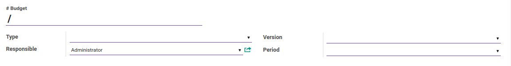
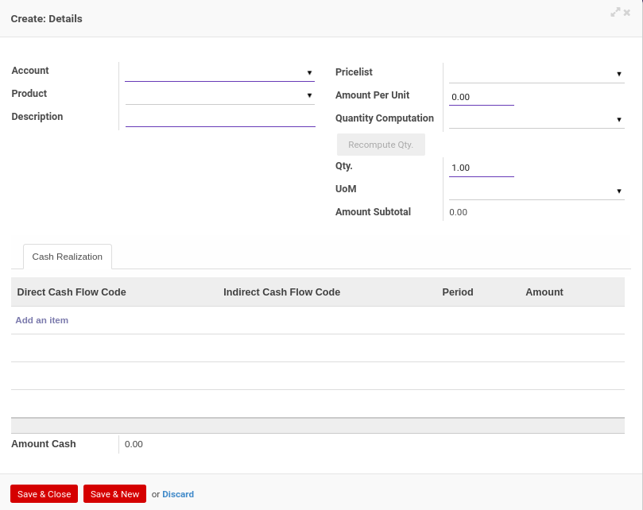

# Penjelasan Financial Budget

Informasi pada *Financial Budget* dibagi menjadi beberapa bagian, yaitu:

* [Header](#bagian-header)
* [Tab Budget Detail](#tab-budget-detail)
* [Tab Accounts](#tab-accounts)
* [Tab Realization](#tab-realization)
* [Tab Summary](#tab-summary)
* [Tab Reviews](#tab-reviews)
* [Tab Notes](#tab-notes)
* [Tab Policies](#tab-policies)
* [Tab Logs](#tab-logs)

### <a name="bagian-header">HEADER</a>

#### <a name="field-no-budget"># Budget</a>

Nomor budget.

#### <a name="field-type">Type</a>

Tipe budget.

#### <a name="field-responsible">Responsible</a>

Nama penanggung jawab budget.

#### <a name="field-version">Version</a>

Versi budget.

#### <a name="field-period">Period</a>

Periode.

#### <a name="tab-budget-detail">TAB BUDGET DETAIL</a>

#### <a name="field-items-table">TABEL Items</a>

Daftar item detail yang termasuk dalam budget.

*Pop Up Items* saat *add an item* diklik.

#### <a name="field-budget-items-account">Account</a>

Nama akun.

#### <a name="field-budget-items-product">Product</a>

Nama produk.

#### <a name="field-budget-items-description">Description</a>

Deskripsi.

#### <a name="field-budget-items-pricelist">Pricelist</a>

Daftar harga yang digunakan untuk item.

#### <a name="field-budget-items-amount-per-unit">Amount Per Unit</a>

Jumlah harga per unit.

#### <a name="field-budget-items-quantity-computation">Quantity Computation</a>

Pilihan perhitungan jumlah unit.

#### <a name="field-budget-items-qty">Qty</a>

Jumlah unit.

#### <a name="field-budget-items-uom">UOM</a>

Satuan unit perhitungan.

#### <a name="field-budget-items-amount-subtotal">Amount Subtotal</a>

Jumlah subtotal.

#### <a name="field-budget-items-tab-cash-realization">Tab Cash Realization</a>

#### <a name="field-budget-items-tab-cash-direct">Direct Cash Flow Code</a>

tbd

#### <a name="field-budget-items-tab-cash-indirect">Indirect Cash Flow Code</a>

tbd

#### <a name="field-budget-items-tab-cash-period">Period</a>

Periode.

#### <a name="field-budget-items-tab-cash-amount">Amount</a>

Jumlah.

#### <a name="field-budget-summary-table">TABEL Summary</a>

Daftar summary dari item budget.

#### <a name="field-budget-summary-account">Account</a>

Nama akun.

#### <a name="field-budget-summary-amount">Amount</a>

Jumlah.

#### <a name="field-budget-summary-planned">Planned Amount</a>

Jumlah rencana.

#### <a name="field-budget-summary-realized">Realized Amount</a>

Jumlah realisasi.

#### <a name="field-budget-summary-diff">Diff. Amount</a>

Jumlah selisih.

#### <a name="tab-accounts">TAB ACCOUNTS</a>

#### <a name="field-accounts-account">Account</a>

Nama akun.

#### <a name="tab-realization">TAB REALIZATION</a>

#### <a name="field-realization-items-table">TABEL Items</a>

Daftar item realisasi budget.

#### <a name="field-realization-items-move"># Move</a>

Nomor referensi perpindahan.

#### <a name="field-realization-items-account">Account</a>

Nama akun.

#### <a name="field-realization-items-journal">Journal</a>

Nama jurnal.

#### <a name="field-realization-items-amount">Amount</a>

Jumlah.

#### <a name="field-realization-summary-table">TABEL Summary</a>

Daftar summary realisasi budget.

#### <a name="field-realization-summary-account">Account</a>

Nama akun.

#### <a name="field-realization-summary-amount">Amount</a>

Jumlah.

#### <a name="tab-summary">TAB SUMMARY</a>

#### <a name="field-summary-account">Account</a>

Nama akun.

#### <a name="field-summary-planned">Planned Amount</a>

Jumlah rencana.

#### <a name="field-summary-realized">Realized Amount</a>

Jumlah realisasi.

#### <a name="field-summary-diff">Diff. Amount</a>

Jumlah selisih.

#### <a name="tab-reviews">TAB REVIEWS</a>

#### <a name="field-definition">Definition</a>

Template multiple approval yang digunakan.

#### <a name="field-review-partners-validations">Review Partners Validations</a>

Nama-nama user yang dapat menyetujui/menolak *budget*.

#### <a name="tabel-validations">TABEL Validations</a>

Tahapan-tahapan persetujuan *budget*.

#### <a name="field-validations-tier">Tier</a>

Urutan persetujuan.

#### <a name="field-validations-validated-by">Validated By</a>

Metode pemilihan user-user yang dapat menyetujui/menolak *budget*. Metode pemilihan terdiri dari 3 (tiga) yaitu:

1. *Specific user*. User-user yang dapat menyetujui/menolak *budget* ditentukan langsung.
2. *Any user in specific group*. User-user yang dapat menyetujui/menolak *budget* adalah user-user yang tergabung dalam kelompok-kelompok user yang ditentukan.
3. *Both specific user and group*. User-user yang dapat menyetujui/menolak *budget* ditentukan langsung ditambah dengan user-user yang tergabung dalam kelompok-kelompok user yang ditentukan.
4. *Python code*. User-user yang dapat menyetujui/menolak *budget* ditentukan oleh algoritma kode python tertentu.

#### <a name="field-validations-reviewers">Reviewers</a>

Nama-nama user yang dapat menyetujui/menolak *budget* pada *tier* yang dimaksud.

#### <a name="field-validations-validated-rejected">Validated/Rejected By</a>

User yang menyetujui/menolak *budget*.

#### <a name="field-validations-date">Date</a>

Tanggal dan waktu **Validated/Rejected By** menyetujui/menolak *budget*

#### <a name="field-validations-date">Status</a>

Status persetujuan, terdiri dari 2 (dua) kemungkinan:

1. **Approved**. Tier disetujui.
2. **Rejected**. Tier ditolak.

#### <a name="tab-notes">TAB NOTES</a>

#### <a name="field-notes">Notes</a>

Catatan.

#### <a name="tab-policies">TAB POLICIES</a>

#### <a name="field-can-confirm">Can Confirm</a>

Berhak/tidaknya user aktif untuk dapat mengkonfirmasi budget.

#### <a name="field-can-restart-approval">Can Restart Approval</a>

Berhak/tidaknya user aktif untuk dapat merestart persetujuan budget.

#### <a name="field-can-approve">Can Approve</a>

Berhak/tidaknya user aktif untuk dapat menyetujui budget.

#### <a name="field-can-cancel">Can Cancel</a>

Berhak/tidaknya user aktif untuk dapat membatalkan budget.

#### <a name="field-can-restart">Can Restart</a>

Berhak/tidaknya user aktif untuk dapat merestart budget.

#### <a name="tab-logs">TAB LOGS</a>

#### <a name="field-logs-confirmation">Confirmation</a>

Waktu konfirmasi dan user yang mengkonfirmasi budget.

#### <a name="field-logs-approval">Approval</a>

Waktu persetujuan dan user yang menyetujui budget.

#### <a name="field-logs-cancellation">Cancellation</a>

Waktu batal dan user yang membatalkan budget.
